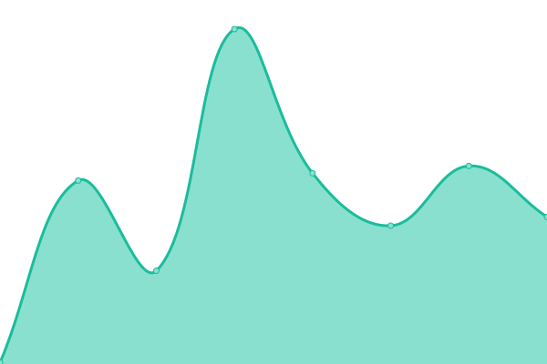
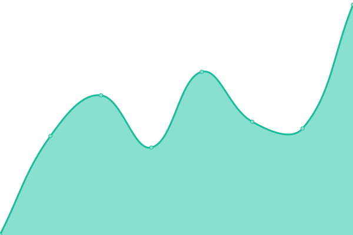

# [📈 Live Status](https://status.laymoth.dev): <!--live status--> **🟥 Complete outage**

This repository contains the open-source uptime monitor and status page for [Laymoth](laymoth.dev), powered by [Upptime](https://github.com/upptime/upptime).

With [Upptime](https://upptime.js.org), you can get your own unlimited and free uptime monitor and status page, powered entirely by a GitHub repository. We use [Issues](https://github.com/laymoth/status/issues) as incident reports, [Actions](https://github.com/laymoth/status/actions) as uptime monitors, and [Pages](https://status.laymoth.dev) for the status page.

<!--start: status pages-->
<!-- This summary is generated by Upptime (https://github.com/upptime/upptime) -->
<!-- Do not edit this manually, your changes will be overwritten -->
<!-- prettier-ignore -->
| URL | Status | History | Response Time | Uptime |
| --- | ------ | ------- | ------------- | ------ |
|  [Website](https://laymoth.dev) | 🟥 Down | [website.yml](https://github.com/laymoth/status/commits/HEAD/history/website.yml) | 

 143ms
     
 | 

<a href="https://laymoth.github.io/status/history/website">100.00%</a>
    

|  [Redirect - Git](https://git.laymoth.dev) | 🟥 Down | [redirect-git.yml](https://github.com/laymoth/status/commits/HEAD/history/redirect-git.yml) | 

 1662ms
     
 | 

<a href="https://laymoth.github.io/status/history/redirect-git">100.00%</a>
    

|  [Redirect - Twitter](https://tw.laymoth.dev) | 🟥 Down | [redirect-twitter.yml](https://github.com/laymoth/status/commits/HEAD/history/redirect-twitter.yml) | 

 3042ms
     
 | 

<a href="https://laymoth.github.io/status/history/redirect-twitter">100.00%</a>
    

|  [Redirect - Matrix](https://matrix.laymoth.dev) | 🟥 Down | [redirect-matrix.yml](https://github.com/laymoth/status/commits/HEAD/history/redirect-matrix.yml) | 

 799ms
     
 | 

<a href="https://laymoth.github.io/status/history/redirect-matrix">100.00%</a>
    

<!--end: status pages-->

[**Visit our status website →**](https://laymoth.dev/status)

## 📄 License

- Powered by: [Upptime](https://github.com/upptime/upptime)
- Code: [MIT](./LICENSE) © [Laymoth](laymoth.dev)
- Data in the `./history` directory: [Open Database License](https://opendatacommons.org/licenses/odbl/1-0/)
